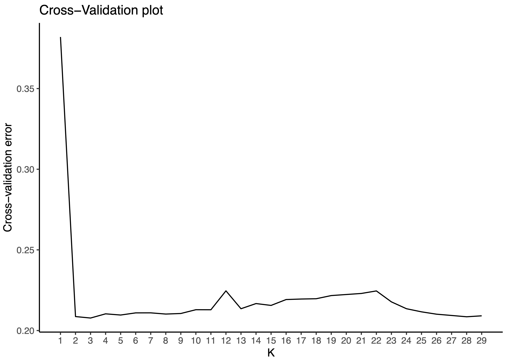
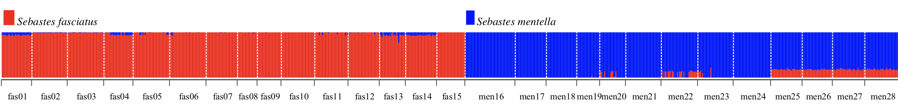

# Fishery genomics of Sebastes: investigating population structure using ADMIXTURE
--------

Using [ADMIXTURE](http://software.genetics.ucla.edu/admixture/), a program customed for SNP datasets only, we aimed to define the genetic units present in two fish species: *Sebastes faciatus* and *S. mentella*. 

ADMIXTURE estimates individual ancestries by efficiently computing maximum likelihood estimates in a parametric model. 
To better understand this program, read the manual page [Alexander 2011](https://www.ncbi.nlm.nih.gov/pmc/articles/PMC3146885/).

*Sebastes faciatus* and *S. mentella* are curently fished in some regions of the Atlantic Canada while in othe regions the stocks are endangered. Using a wide dataset of SNPs markers may help us to better delineate the stock structure than with the use of microsatellites.

## 1. Run the ADMIXTURE program

** Prepare a .bed file** from your vcf file.
To do so, first use [VCFTOOLS](http://vcftools.sourceforge.net) in the terminal.
```{r, engine = 'bash', eval = FALSE}
vcftools --vcf nameofyourfile.vcf --plink-tped --out nameofyourfile
```

Then, use and [PLINK](http://zzz.bwh.harvard.edu/plink/).
```{r, engine = 'bash', eval = FALSE}
plink --tped nameofyourfile.tped --tfam nameofyourfile.tfam --make-bed --out nameofyourfile
```

The commend `--make-bed` will produce three files:
- a binary ped file (*.bed)
- the pedigree/phenotype information file (*.fam)
- an extended MAP file (*.bim) that contains information about the allele names, which would otherwise be lost in the .bed file

**Run Admixture** in bash.
Go into the folder where your bed file is. 
Run admixture on your .bed file in your terminal by typing:

```{r, engine = 'bash', eval = FALSE}
for K in echo $(seq 29) ; do admixture --cv=10 -B2000 -j8 nameofyourfile.bed $K | tee log${K}.out; done
```
Usually the maximum number of K - to test as a first step - is selected based on the number of sampling locations that you have. Here we had 28 sampling locations (n = 28), so we first tested a K max = n + 1 = 29.

**Collect the cross validation information** obtained from the all the log files.
```{r, engine = 'bash', eval = FALSE}
grep -h CV log*.out>cross_validation.txt
done
```

Extract the **right order for individual id** from your vcf file, using the tfam file information.
To do so, you need to use [VCFTOOLS](http://vcftools.sourceforge.net)  with the following command:
```{r, engine = 'bash', eval = FALSE}
cut -f 1 nameofyourfile.tfam > id_admixture.txt
done
```

```{r, engine = 'bash', eval = FALSE}
cut -f 1 nameofyourfile.tfam > id_admixture.txt
done
```

## 2. Find the optimal number of clusters

Using the R environment, first check the percent of error due to the number of genetic cluster inferred. 
Several methods used for defining the optimal number of clusters. 

Keep in mind not over interpreting the number o clusters defined by this analysis and to complement ADMIXTURE approch with a `Principal Component Analysis`or a `Discriminant Principal Component Analysis`. 
Indeed [ADMIXTURE](http://software.genetics.ucla.edu/admixture/),which is similar to [STRUCTURE](https://web.stanford.edu/group/pritchardlab/structure.html), is based on model assumptions that do not always follow the biological reality of your dataset. 
See [Lawson et al] (https://www.nature.com/articles/s41467-018-05257-7) for careful advices on how to interpret ADMIXTURE results.

In R, **download libraries**:
```{r}
library(stringr)
library(ggplot2)
library(dplyr)
```
Download the **cross-validation** results you have previously created via bash command.
```{r}
cv <- read.table("cross_validation.txt")
```

Analyze the **cross-validation** results
Then, add a K-cluster column indicating the number of K you test and select only two columns of interest, CV and K.
```{r}
cv$K <-gsub("[\\(\\)]", "", regmatches(cv$V3, gregexpr("\\(.*?\\)", cv$V3)))
CV <- select(cv, V4,K)
```

Rename your two columns CV and K-cluster
```{r}
colnames(CV) <- c("CV","K")
```

Do a **graph showing the cross validation results**.
Then select the optimal number of clusters regarding :
- the lowest cross validation error
- when the cross-validation error decrease the most

```{r}
graph_title="Cross-Validation plot"
x_title="K"
y_title="Cross-validation error"
graph_1<-ggplot(CV,aes(x=K,y=CV))
graph_1+geom_line()+scale_x_continuous(breaks=c(1,2,3,4,5))+
  labs(title=graph_title)+
  labs(x=x_title)+
  labs(y=y_title)+
  theme(axis.text.x=element_text(colour="black"))+
  theme(legend.title=element_blank())+
  theme(axis.text.y=element_text(colour="black",size=12))+
  theme(axis.text.x=element_text(colour="black",size=12))+
  theme(panel.border = element_rect(colour="black", fill=NA, size=3),
        axis.title=element_text(size=18,colour="black",family="Helvetica",face="bold"))
```
Save the graph
```{r}
ggsave("Admixture_cross-validation.pdf",width=7,height=5,dpi=600)
dev.off()
```


# 3. Analyse Q estimates results

In this section, the goal is to delineate how is distributed the percent of ancestry to each genetic cluster found, and this for each individual. Assignment of clusters can be sometimes trivial while any clear population structure patterns tend to emerge or even when the vas majority of the individuals tends to show less 50% of ancestry to one genetic cluster (suggesting admixed populations). 
One common mistake is to have an unbalanced number of samples per population. This brings out a high number of indivdiuals that tend to belong to this large population instead of other populations, as this population has  

First **download libraries**:
```{r}
library(reshape2)
library(plyr)
library(stringr)
library(ggplot2)
library(tidyverse)
library(RColorBrewer)
```

Read **file.Q with the Q = the optimal K** 
```{r}
admixture <- read.table("24603snps_860ind.2.Q")
```

Add one column with the individuals names and the population they belong to.
```{r}
id <- read.table("860ind_sebastes.txt",header=TRUE)
admixture <- cbind(id,admixture)
```

Rename columns.
```{r}
colnames(admixture) <- c("IND","POP","K1","K2")
```

Transform the admixture object into a long format.
```{r}
admixture_long <- melt(admixture,id.vars=c("IND","POP"),variable.name="ANCESTRY",value.name="PERC")
names(admixture_long)
class(admixture_long$ANCESTRY)
levels(admixture_long$ANCESTRY)
```

Subset only the individuals showing more than 50% of ancestry with one genetic cluster
```{r}
admixture_long_50 <- subset(admixture_long, subset=admixture_long$PERC>=0.50)
```

Give a palett color
```{r}
col2 <- c('blue',"red")
```

Make a **graph with ADMIXTURE results**.
```{r}
graph_title="Stacked barplot of Admixture analysis in species"
x_title="Individuals"
y_title="Ancestry"
graph_1<-ggplot(admixture_long_50,aes(x=POP,y=PERC,fill=ANCESTRY))
graph_1+geom_bar(stat="identity")+
scale_fill_manual(values=col2, name= "K", labels=c("K1","K2"))+ 
  labs(y=y_title)+
  labs(x=x_title)+
  theme(panel.grid.major.x = element_blank(),
        panel.grid.minor.x = element_blank(),
        panel.grid.major.y = element_line(colour="grey", linetype="dashed"),
        axis.title.x=element_text(size=14,family="Helvetica",face="bold"),
        axis.text.x=element_text(size=6,family="Helvetica",face="bold", angle=90, hjust=0, vjust=0.5),
        axis.title.y=element_text(size=14,family="Helvetica",face="bold"),
        axis.text.y=element_text(size=14,family="Helvetica",face="bold"))
```

Save the graph.
```{r}
ggsave("Sebastes_cercles.pdf",width=15,height=10,dpi=600,units="cm",useDingbats=F)
```

Check **the percent of ancestry per sampling locations(POP) and per individuals (IND)**.
```{r}
aggregate(admixture[, 2:6], list(admixture$POP), mean)
aggregate(admixture[, 2:6], list(admixture$IND), max)
```

Estimate at which each genetic group belong each indivdiual regarding its maximum % of ancestry.
```{r}
admixture[, "max"] <- apply(admixture[, 2:6], 1, max)
summary(admixture)
```

Check the indivdiuals that could not be clearly attributed to one genetic cluster.
```{r}
admixture_subset <- subset(admixture, subset=admixture$max >= 0.5)
```

Report how many individuals per cluster.
```{r}
admixture_cluster <- select(admixture, K1,K2,K3,K4,K5)
admixture %>% 
  gather(POP,cnt, K1:K5) %>% 
  group_by(POP) %>% 
  slice(which.max(cnt)) 
```

Create a pop map regarding the cluster found.
```{r}
admixture_subset$CLUSTER <- colnames(admixture_subset)[apply(admixture_subset,1,which.max)]
admixture_results <- select(admixture_subset, IND, CLUSTER)
```

Save the files.
```{r}
write.table(admixture_results, 'Admixture_results_K2.txt',quote=FALSE, row.names=FALSE, sep="\t", dec=".")
table(admixture_subset$CLUSTER, admixture_subset$POP)
```

Calculate the number of individuals with ancestry bellow 50%.
```{r}
quantile(admixture$max)
group_unknown <- subset(admixture, subset=admixture$max<0.5)
group_unknown$POP <- substr(group_unknown$IND,1,5)
table(group_unknown$POP)
```

## 4. Produce nice graphs from ADMIXTURE results

Install the dependency packages and libraries required.
```{r}
install.packages(c("Cairo","devtools","ggplot2","gridExtra","gtable","tidyr"),dependencies=T)
library(pophelper)
```

Check `pophelper`version.
```{r}
packageDescription("pophelper", fields="Version")
```

Install the current version of `pophelper`.
```{r}
devtools::install_github('royfrancis/pophelper', force=TRUE)
```

Load population map.
```{r}
popmap =  read.delim("444ind_admixture.txt",header=FALSE,stringsAsFactors=F)
pop_order = sort(unique(popmap$V1))
```

Load admixture files.
```{r}
sfiles <- list.files(pattern = "*.Q", full.names=T)
```

**Import the .Q files**.
```{r}
slist <- readQ(files=sfiles, filetype = "basic")
```

Qlist attributes
```{r}
attributes(slist)
```

Import labels for ADMIXTURE runs.
```{r}
labset <- read.table("860ind_pop.txt",header=TRUE,stringsAsFactors=F)
```

**Verify that the length of labels is equal to number of individuals**.
```{r}
nrow(labset)
```

Check if labels are a character data type.
```{r}
sapply(labset, is.character)
class(labset)
```

Give a palett color.
```{r}
col2 <- c('blue',"red")
```

Create a qplot for K = 2 considering two species.
```{r}
slist1 <- alignK(slist[1]) 
plotQ(slist1,  clustercol= col2,
      ,showsp=FALSE,grplab = labset,ordergrp=T,imgtype="pdf",
      showlegend=T, legendpos="right", legendkeysize = 6, legendtextsize = 6)
```


